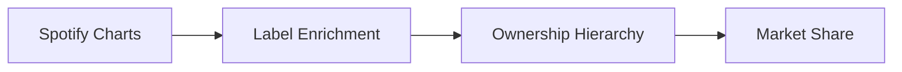
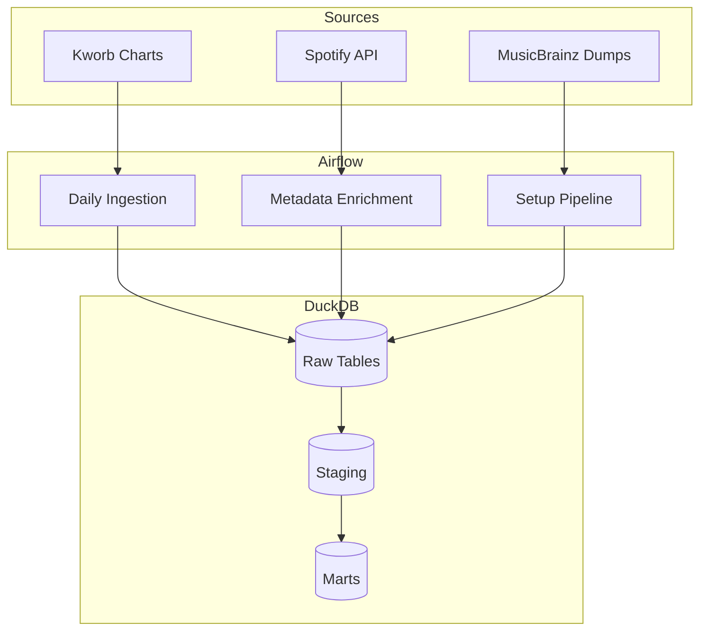
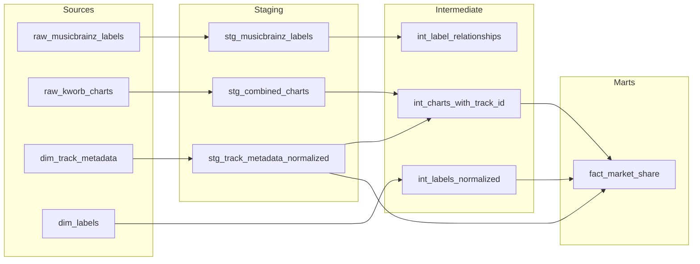

# Music Market Share Warehouse

End-to-end data pipeline attributing Spotify streaming volume to ultimate parent labels (UMG, Sony, Warner vs. Independent). Built with Airflow, DuckDB, and dbt.



## Results

Market share by parent group (Dec 2024 daily charts, 26.9B streams):

| Parent Group | Streams | Share |
|-------------|--------:|------:|
| Universal Music Group | 11.3B | 41.9% |
| Sony Music Entertainment | 6.3B | 23.3% |
| Warner Music Group | 5.4B | 20.2% |
| Independent / Other | 2.9B | 10.8% |
| Unmapped | 1.0B | 3.8% |
| **Big 3 Total** | **23.0B** | **85.4%** |

The 85% reported here is higher than the commonly cited 65-70% for the big 3 because this project measures chart-topping tracks only, hits skew heavily toward majors who dominate playlist placement and marketing. The 65-70% figure covers all streaming including long-tail catalog.

## Architecture



**Stack:** Docker Compose / Airflow 2.10 / DuckDB / dbt-core

## Pipeline

1. **Ingest** — Scrape daily Spotify charts from Kworb → Parquet
2. **Enrich** — Query Spotify API for track→label metadata
3. **Load** — MusicBrainz label dumps → DuckDB (321K labels, 64K relationships)
4. **Transform** — dbt builds ownership hierarchy via recursive traversal
5. **Aggregate** — Incremental fact table joins charts to parent groups

## dbt Lineage



*Note: `dim_labels` is created by Python/NetworkX (not dbt) via graph traversal of MusicBrainz ownership relationships.*

## Quickstart

```bash
cp .env.example .env  # Add Spotify credentials for enrichment
docker compose up --build
```

Open Airflow at `localhost:8080` (admin/admin). Trigger `setup_musicbrainz_data`, then unpause `music_market_share_ingest`.

Query results:
```bash
duckdb data/music_warehouse.duckdb "
  SELECT parent_group, SUM(total_streams) as streams
  FROM fact_market_share GROUP BY 1 ORDER BY 2 DESC
"
```

## Data Sources

| Source | Description | Update |
|--------|-------------|--------|
| [Kworb](https://kworb.net) | Daily Spotify global charts | Daily scrape |
| [MusicBrainz](https://musicbrainz.org) | Label ownership relationships | Manual dump load |
| Spotify API | Track → album → label metadata | On-demand enrichment |

## Future Work

- **Merlin integration** — Cross-reference indie labels against Merlin member list to distinguish independent from indie distributed by major.
- **Time-series analysis** — Market share trends, seasonality detection, regime change identification
- **Causal inference** — Impact of playlist placement, release timing, and marketing spend on market share shifts
- **Predictive modeling** — Forecast label market share using leading indicators (social buzz, playlist adds, release schedule)
- **Trading signals** — Backtest strategies correlating streaming momentum with UMG/Sony/Warner equity returns

## License

MIT
