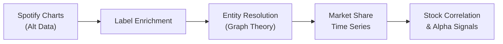
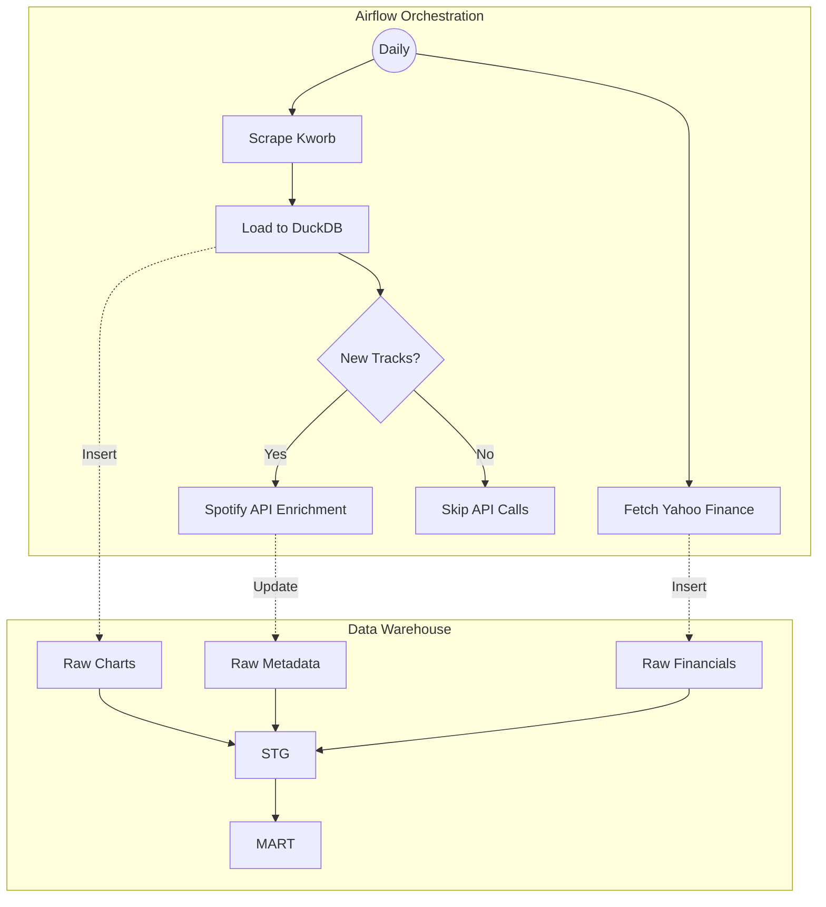

# Music Industry Alternative Data & Price Signals

End-to-end alternative data pipeline that constructs a proprietary dataset tracking the daily streaming market share of major music labels (Universal, Sony, Warner) and correlates this with their stock prices for quantitative research.



## Results

Market share by parent group (Dec 2024 daily charts, 26.9B streams):

| Parent Group | Streams | Share |
|-------------|--------:|------:|
| Universal Music Group | 11.3B | 41.9% |
| Sony Music Entertainment | 6.3B | 23.3% |
| Warner Music Group | 5.4B | 20.2% |
| Independent / Other | 2.9B | 10.8% |
| Unmapped | 1.0B | 3.8% |
| **Big 3 Total** | **23.0B** | **85.4%** |

The 85% reported here is higher than the commonly cited 65-70% for the big 3 because this project measures chart-topping tracks only, hits skew heavily toward majors who dominate playlist placement and marketing. The 65-70% figure covers all streaming including long-tail catalog.

## Architecture



Daily charts are scraped from Kworb via Playwright. A trigger in Airflow checks the staging area for new tracks and only calls the Spotify API if metadata is missing, saving API quota and execution time. Financial data is fetched independently. dbt transforms resolve ownership hierarchies and aggregate streams.

**Stack:** Docker · Airflow · DuckDB · dbt · NetworkX

## Entity Resolution via Graph Theory

A key  challenge is resolving the ultimate parent company to a tradable entity for thousands of sub-labels. For example, "pgLang, under exclusive license to Interscope Records" → Interscope → Universal Music Group

The [`scripts/build_hierarchy.py`](scripts/build_hierarchy.py) script uses NetworkX to:
1. Build a directed graph of 64K+ label-to-label ownership relationships from MusicBrainz
2. Traverse the graph recursively to find the root parent node for each label
3. Classify labels into market share groups (UMG, Sony, Warner, Independent)

This approach handles complex nested ownership that would be impossible to resolve with simple pattern matching.

## Quantitative Analysis

The [`notebooks/market_share_alpha.ipynb`](notebooks/market_share_alpha.ipynb) notebook explores market share trends of the big 3 with moving averages, momentum signals, Z-score deviations, rate-of-change indicators, correlations of market share vs UMG.AS, WMG, SONY stock prices, and lead/lag analysis.

To run the analysis:
```bash
# Open the notebook (Data is already fetched by Airflow)
jupyter notebook notebooks/market_share_alpha.ipynb
```

## Quickstart

```bash
cp .env.example .env  # Add Spotify credentials for enrichment
docker compose up --build
```

Open Airflow at `localhost:8080` (admin/admin). Trigger `setup_musicbrainz_data`, then unpause `music_market_share_ingest`.

Query results:
```bash
duckdb data/music_warehouse.duckdb "
  SELECT parent_group, SUM(total_streams) as streams
  FROM fact_market_share GROUP BY 1 ORDER BY 2 DESC
"
```

## Data Sources

| Source | Description | Update |
|--------|-------------|--------|
| [Kworb](https://kworb.net) | Daily Spotify global charts | Daily (Airflow) |
| [MusicBrainz](https://musicbrainz.org) | Label ownership relationships | One-off / Manual |
| Spotify API | Track → album → label metadata | Daily (Airflow) |
| Yahoo Finance | UMG.AS, WMG, SONY stock prices | Daily (Airflow) |

## Future Work

- **Merlin integration** — Cross-reference indie labels against Merlin member list to distinguish independent from indie distributed by major.
- **Backtesting framework** — Build simple trading strategies based on market share momentum signals
- **Granger causality** — Statistical tests to validate predictive relationships
- **Earnings correlation** — Map quarterly market share trends to earnings surprises
- **Multi-platform expansion** — Add Apple Music, Amazon Music for broader coverage

## License

MIT
